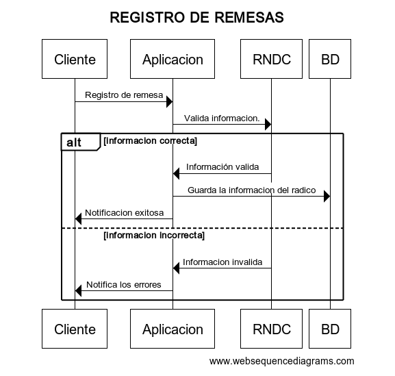

# Viajes/Manifiestos

Un viaje o manifiesto representa la operación completa de transporte, incluyendo la información del vehículo, conductores y la ruta a seguir.

## Información que contiene un viaje/manifiesto

- Datos del vehículo y conductores
- Remesas asociadas al viaje
- Ruta detallada (origen, destino y paradas intermedias)
- Fechas y horas programadas
- Información de trailers (si aplica)

## Flujo de trabajo con viajes/manifiestos

1. Creación del viaje: Se asocian remesas y se ingresa la información requerida.
2. Estado PENDIENTE: El viaje se guarda y puede ser editado.
3. Envío al RNDC: Se transmite la información al RNDC.
4. Estado REGISTRADO: Confirmación de registro en el RNDC. No se permiten más modificaciones.
5. Estado COMPLETADO: Se actualiza con la información real del viaje.
6. Estado CANCELADO: En caso de anulación, se registra en el RNDC.

El módulo de Operaciones permite una gestión eficiente y conforme a la normativa de todas las actividades de transporte, asegurando un seguimiento preciso desde la creación de la remesa hasta la finalización del viaje.

##  Creación de viaje 

Ingresar a detalle toda la información del viaje y remesas ya creadas.

###  Características del viaje / manifiesto

| Nombre del campo | Requerido | Descripción |
| ---------------- | --------- | ----------- |
| Tipo de operación |   si     | Seleccionar el tipo de operación del viaje |
| Tipo de manifesto | si       | Seleccionar el tipo de manifiesto del viaje | 
| Consecutivo del manifiesto | si | Combinación de caracteres, letras y/o números  única del viaje | 
| Fecha de expedición | no | Indicar fecha de expedición del manifiesto |
| Rutas | si | Seleccionar ruta del manifiesto (la ruta debe estar creada previamente  en catálogos - rutas)

###  Titular del manifiesto 

| Nombre del campo | Requerido | Descripción |
| ---------------- | --------- | ----------- |
| Tipo de documento | si | Tipo de documento del titular del manifiesto |
| Número de documento | si | combinación de letras, números y/o caracteres del documento del titular del manifiesto |
| Sedes | si | Seleccionar sede del titular del manifiesto (El titular del manifiesto debe estar registrado previamente en terceros para acceder a las sedes ingresadas) |

### Información del vehículo    

| Nombre del campo | Requerido | Descripción |
| ---------------- | --------- | ----------- |
| Placa de vehículo | si  | Combinación de letras, números y/o caracteres que pertenezcan a la placa del vehículo que va a realizar el viaje (El vehículo debe estar registrado previamente en catálogos - vehículos y remolques) |
| Placa de trailer Uno | no | Combinación de letras, números y/o caracteres que pertenezcan a la placa del trailer que va a realizar el viaje (El trailer debe estar registrado previamente en catálogos - vehículos y remolques)
| Placa de trailer dos | no | Combinación de letras, números y/o caracteres que pertenezcan a la placa del trailer que va a realizar el viaje (El trailer debe estar registrado previamente en catálogos - vehículos y remolques)


###  Conductor

| Nombre del campo | Requerido | Descripción |
| ---------------- | --------- | ----------- |
| Tipo de documento | si | Tipo de documento del conductor del vehículo | 
| Número de documento | si | Combinación de letras, números y/o caracteres que pertenezcan al tipo de documento del conductor del vehículo |
| Tercero |  -- | El nombre del tercero debe ser visible de forma automática al ingresar el numero de documento del tercero (el conductor del vehículo debe estar registrado previamente en catálogos - terceros) |

###  Valor del viaje 


| Nombre del campo | Requerido | Descripción |
| ---------------- | --------- | ----------- |
| Valor del flete | no | Ingresar valor del viaje | 
| Retención ICA (%*mil) | no | Ingresar porcentaje de retención de ICA |
| Valor del anticipo | no | Ingresar valor del anticipo |
| Fecha de pago del saldo | no | Ingresar fecha del pago del saldo por pagar | 
| Departamento | no | Seleccionar departamento |
| Municipio | no | Seleccionar municipio ( Las opciones deben ser visibles una vez se seleccione el departamento) |

###  Responsable del pago 

| Nombre del campo | Requerido | Descripción |
| ---------------- | --------- | ----------- |
| Cargue Tipo de responsable | no | Seleccionar el responsable del pago del cargue|
| Descargue Tipo de Responsable | NO | Seleccionar el responsable del pago del descargue |
| Observaciones | no | Ingresar observaciones del manifiesto |

###  Remesas 

Ingresar remesas registradas en Operaciones - Remesas 

Registrar remesas en el ministerio 

<details>
  <summary>Codigo base del diagrama</summary>

  ```js
title REGISTRO DE REMESAS 

Cliente->Aplicacion: Registro de remesa
Aplicación-> RNDC: Valida información.
alt información correcta
    RNDC->Aplicacion: Información valida  
    Aplicacion-> BD: Guarda la información del radico
    Aplicacion->Cliente: Notificación exitosa
else información incorrecta
    RNDC->Aplicacion: Informacion invalida
    Aplicacion->Cliente: Notifica los errores
end

  ```
</details>


